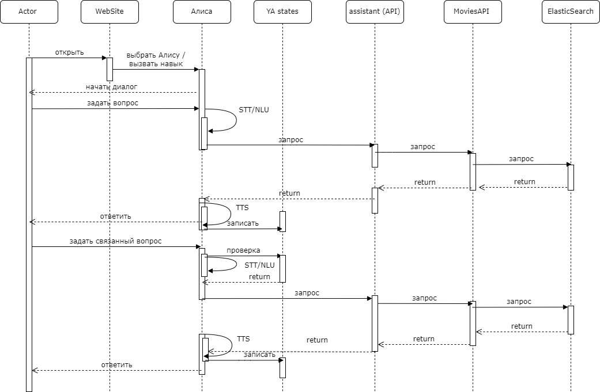

# Проектная работа: диплом "Ассистент"

## Техническое задание

### 1. Введение
Настоящее техническое задание определяет требования к разработке системы голосового поиска информации о фильмах. Система предназначена для облегчения процесса поиска информации о фильмах пользователями, позволяя им получать необходимые данные с помощью голосовых команд.
### 2. Цели и задачи проекта
Целью проекта является создание удобной и эффективной системы голосового ассистента для поиска информации о фильмах. Система должна обеспечивать быстрый и лёгкий доступ к данным о фильмах, позволяя пользователям получать необходимую информацию с помощью голосовых команд.
Для достижения поставленной цели необходимо решить следующие задачи:
- Разработать архитектуру системы, обеспечивающую взаимодействие с ElasticSearch, API и голосовыми помощниками.
- Реализовать алгоритмы определения интентов и сущностей в запросах пользователей.
- Создать механизмы обработки запросов и предоставления релевантной информации о фильмах.
- Разработать систему поддержки связанных запросов для предоставления более подробной информации о фильмах.
- Интегрировать систему с внешними голосовыми помощниками для обеспечения гибкости выбора пользователей.
- Реализовать механизмы хранения состояния запросов и ответов для поддержания контекста и персонализации.

### 3. Функциональные требования
Система должна обеспечивать выполнение следующих функций:
- Голосовой поиск информации о фильмах.
- Определение интентов и сущностей в запросах пользователей.
- Обработка запросов и предоставление релевантной информации о фильмах.
- Поддержка связанных запросов для получения более подробной информации о фильмах.
- Интеграция с внешними голосовыми помощниками.
- Хранение состояния запросов и ответов.
### 4. Нефункциональные требования
Система должна соответствовать следующим нефункциональным требованиям:
- Безопасность данных пользователей и защита от несанкционированного доступа.
- Доступность системы для пользователей в любое время и из любого места.
- Масштабируемость системы для обработки большого количества запросов без потери производительности.
- Надёжность системы и высокая степень доступности данных.
- Удобство использования интерфейса системы.
- Поддержка различных устройств, включая смартфоны, планшеты и компьютеры.
- Тестируемость системы для гарантии качества и надёжности работы.

## Особенности реализации 
### 
Сервис состоит из двух основных компонентов:
- Ассистент на базе Яндекс Алисы.
- Собственный ассистент Duke.

#### Ассистент на базе Яндекс Алисы работает следующим образом:

1. Пользователь запускает навык Алисы и делает запрос голосом.
2. Алиса переводит запрос в машиночитаемый вид, определяет интенты и сущности и передаёт его на API ассистента (assistent_api).
3. API обрабатывает запрос, выявляет нужную сцену, отправляет запрос на movie_api, который обращается к ElasticSearch.
4. Ответ от ElasticSearch возвращается к API, который передаёт его Алисе.
5. Алиса зачитывает ответ пользователю.

#### Собственный ассистент Duke работает аналогично, но имеет некоторые отличия:

1. Пользовательский доступ к ассистенту осуществляется через веб-сайт севиса кинофильмов 
2. Распознвание аудио, выявление интентов и сущностей, перевод текста в аудио для ответа происходит на стороне assistent_api. 

#### 
Сервис потенциально можнт работать с любым внешним голосовым помощником, таким как Маруся. Интенты и сущности могут быть определены как на стороне внешнего голосового помощника, так и самостоятельно в API.

#### 
Особенностью системы является поддержка связанных запросов за счёт хранения состояния (упомянутого фильма или режиссёра) в хранилищах. Для Алисы можно использовать её хранилище, а для Duke — собственное хранилище на Redis.

### Используемые технологиий
- fastapi
- redis
- fasttext (классификация текстов - выявление инентов)
- fuzzywuzzy (выявление сущностей - кинофильмов)
- spacy (выявление сущностей - фамилий и имен)
- speech_recognition (аудио в текст)
- gtts (текст в аудио)
- яндекс.диалоги

